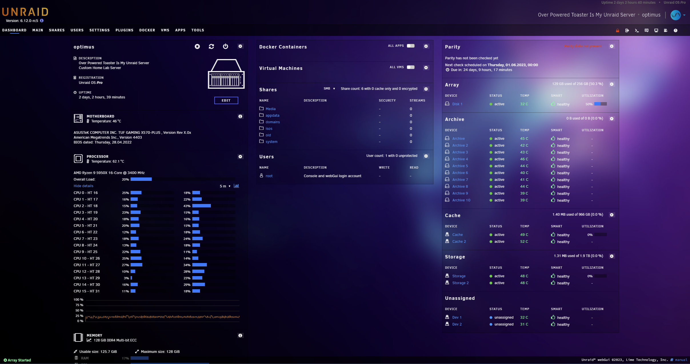
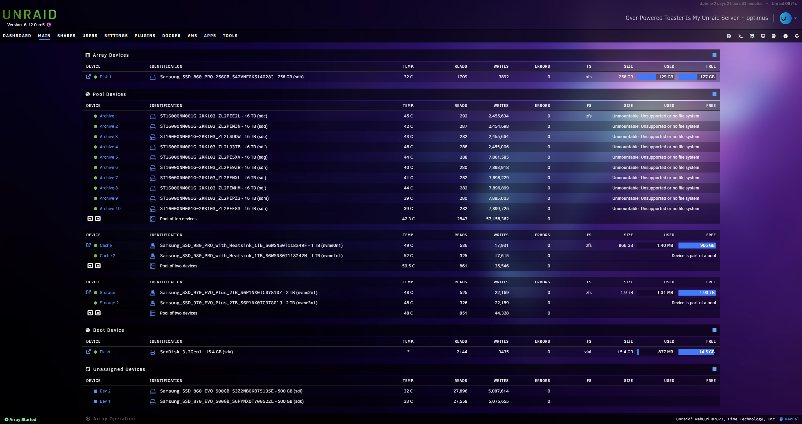
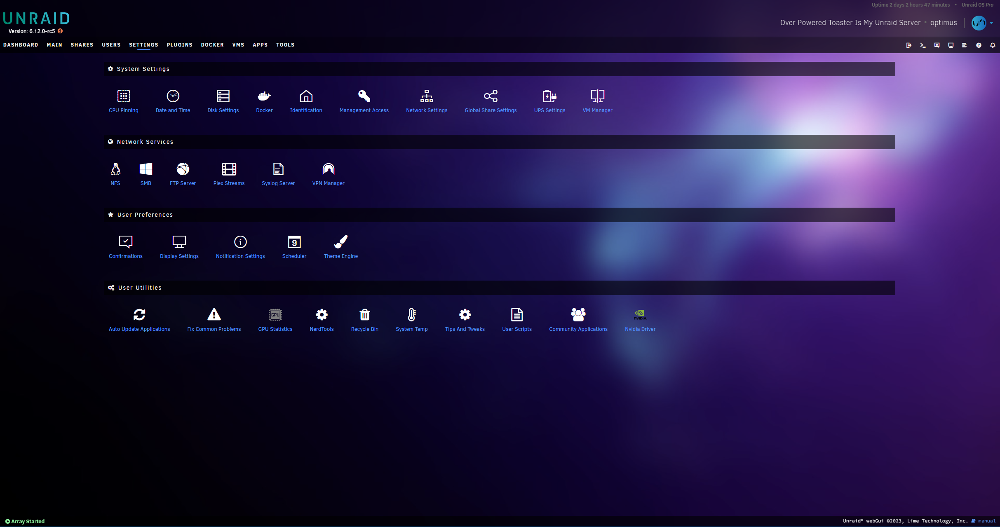
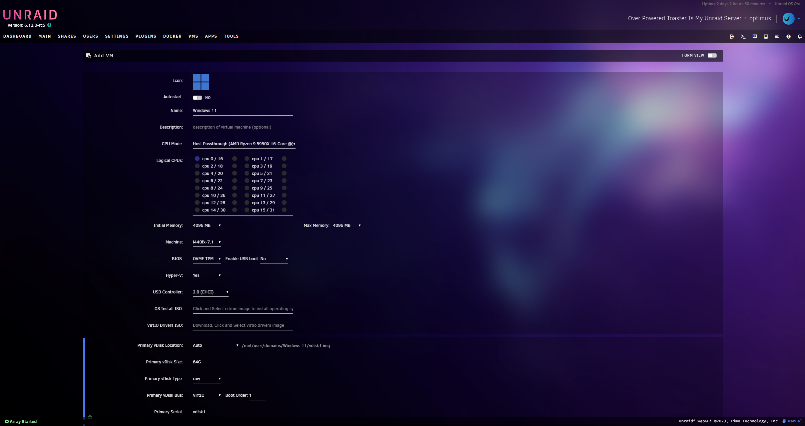
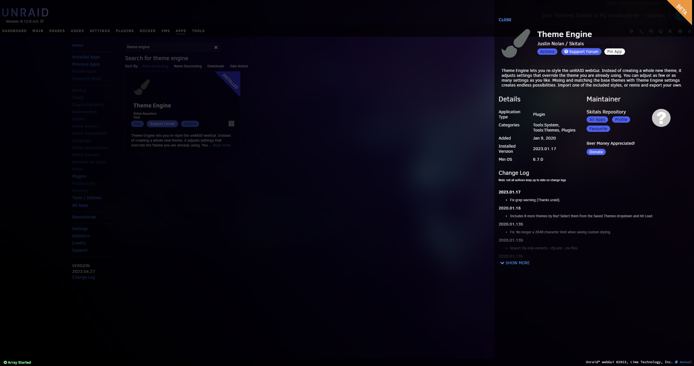

# Neonglass
Neonglass is a custom unRAID theme for the use with theme-engine. The theme is based on the [work](https://forums.unraid.net/topic/127365-unraid%E4%B8%BB%E9%A2%98%EF%BC%8C-%E8%87%AA%E5%AE%9A%E4%B9%89theme-%E8%83%A1%E6%A1%83%E5%8E%9F%E7%A5%9E/) of [@zisen](https://forums.unraid.net/profile/173690-zisen/).

The theme should support most plugins out of the box. Unfortunately,  it is not possible to apply theming to certain elements (e.g., textareas when editing the XML for VMs; CPU usage graph line color). However, if you do come across any other bugs, feel free to open an issue or preferably a pull request if you know how to fix it.


## How to install

First install [theme-engine](https://forums.unraid.net/topic/87126-plugin-theme-engine-a-webgui-styler/) from the community app store. Then goto `Settings/Theme Engine` and paste the following link under the `Import Zip` section into the `From URL` field.
```
https://github.com/tenasi/unraid-neonglass/releases/download/1.0.0/Neonglass.zip
```
After this, select Neonglass from the list of saved themes and hit apply.


## Edit theme an install manually

If you wish to make changes to the theme you can also download `style.css` from this repository and modify the theme to your own needs. To install your custom `style.css` go to `Settings/Theme Engine`, select `Black` under `Base Theme`. Under `Theme Settings` make sure to enable `Advanced View` and set `Enable Theme Engine` and `Enable custom styling` to `Yes`. Then paste the contents of your modified `style.css` into the section `Custom styling (advanced)` and hit apply.

The official release only includes the minified css `minified.css`. The complete and formatted stylesheet `style.css` also includes some javascript to change the names of system fans. This is only relevant if you have the `Dynamix System Temperature` plugin installed. With this plugin you can show the RPM of recognized fans on the Dashboard. But the plugin will only show `FAN 1`, `FAN 2`, etc. If you wish to modify the names, to have to edit the javascript at the bottom of `style.css` accordingly. In my case `FAN 1` becomes `CPU FAN 1`, `FAN 2` becomes `PCH Fan` and so on.

## Screenshots












## Known Issues
- Styling of large textareas (e.g. VM XML Advanced View, User Scripts, Plugin Install Popup)
- NerdTools Table (could be fixed, but not a priority for me)
- Text color of uptime and unRAID License in the top right corner
- unRAID logo in the top right corner (color can be modified by appliying filters, but not configured directly)
- Line colors of charts (e.g. CPU utilization, network utilization)


## Future Plans
I plan to maintain this theme as long as I actively  use unRAID. In addition, I have been playing around with custom plugins for a while now and I may create a standalone plugin to install this theme without `theme-engine` and ideally include some specific settings to enable some features or change variables. Any know how in plugin creation is greatly appreciated.